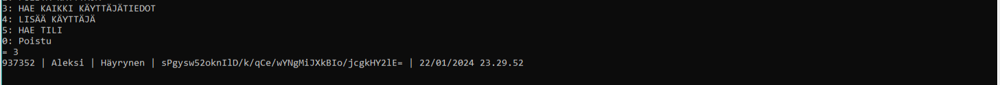
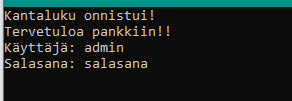
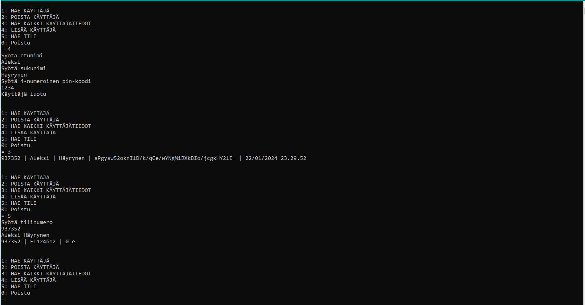
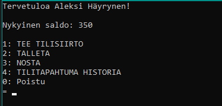
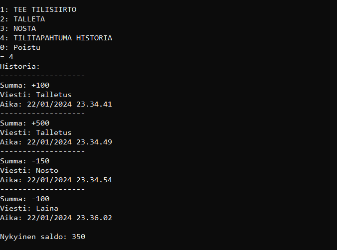

# ATMachine

## Table of Contents
- [Project Overview](#project-overview)
- [Features](#features)
- [Database](#database)
- [Security](#security)
- [Usage](#usage)
- [Documentation](#documentation)

## Project Overview
A console-based online bank/ATM program we developed as a group project for our software development course using C#. During the project, we utilized Scrum practices and held weekly meetings to discuss our sprint goals and retrospectives. The program uses a local JSON file as a database, allowing us to create different users and features. We also created comprehensive documentation for the project, which you can find in the repository. Throughout this project, we also practiced version control and learned how to approach planning and mapping software. Note that certain documentation, such as scrum meetings and workhour records, has been excluded to ensure the privacy and security of personal information.

## Features
- Deposit/Withdraw
- User login
- Admin User/Managing users
- Transferring money between accounts & Users
- User transaction history

## Database
- KayttajaTiedot.json
- We used local JSON as the database for this project.
- You can use this to look at the user login digits if you forget ;D
.png)

## Security
- The passwords of users that go into the DB are hashed & salted.
- As stated in the documentation of this project, do not use any real information you do not want to compromise in this program. This was only meant for unofficial use.

## Usage
- In the Ohjelmisto directory, there is a pankki.exe program that starts the program. If the database KayttajaTiedot.json does not exist, it will create it when you start the program for the first time.
- The first time you have to log in using the admin credentials: admin, salasana

- The user info can be a 6-digit, and when the password is the pin you set up. We looked at how our bank login works and took a similar approach.
- Moving money across users is done by using the 6-digit user number.
- For more information, check the documentation.

## Documentation
- Under the Vaatimusmäärittely directory, you will find a Word document containing most of the information about the features and environment.

## Screenshots

---
